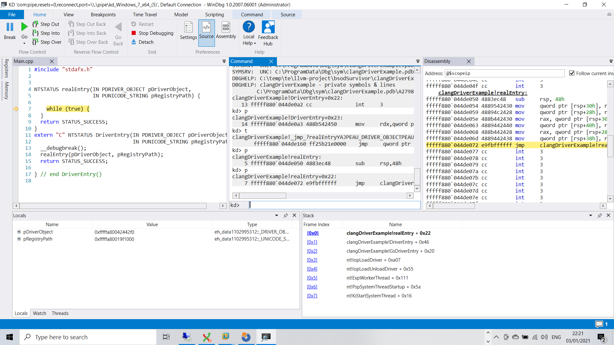
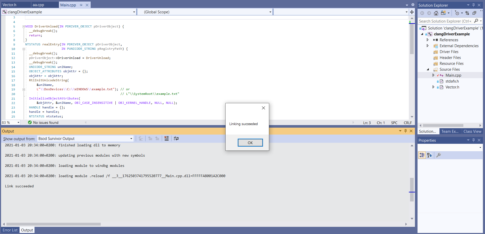
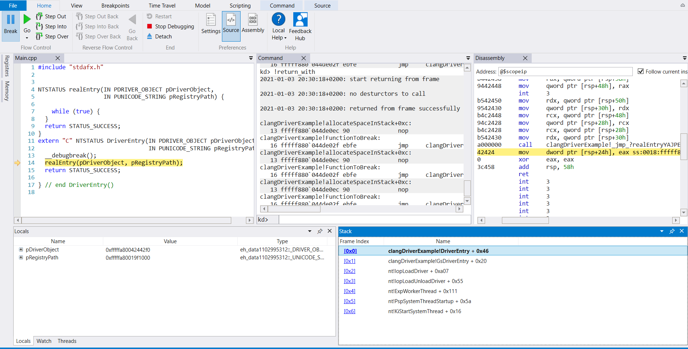
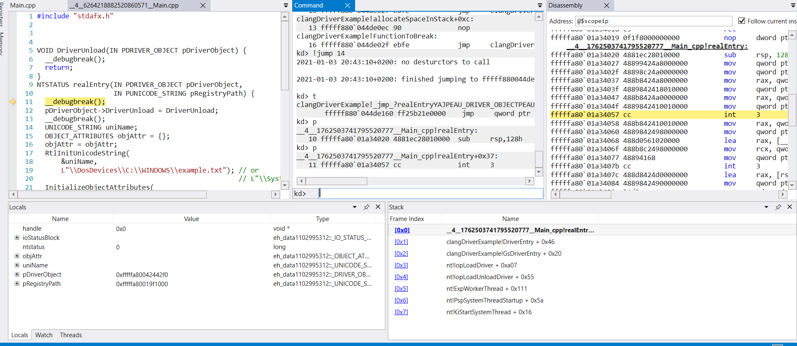
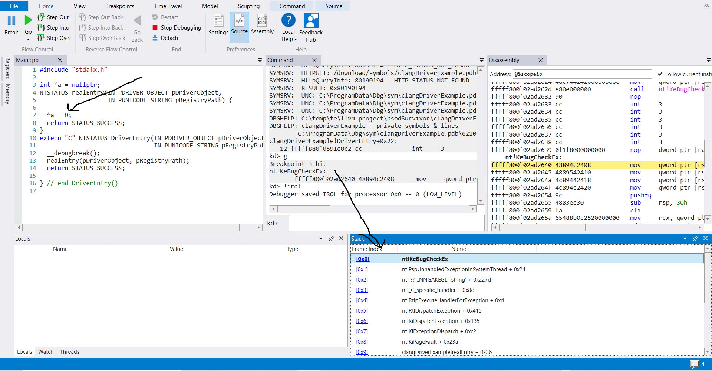
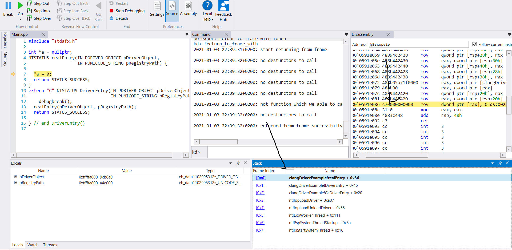

# BSOD Survivor

Tired of always telling yourself when you got a BSOD that what if I could just return to the caller function which caused the BSOD, and change its args? or just do any change? and instead of that you need to do the tiersome reboot/revert to the machine, attach Windbg again to the machine, and hope it isn't some statistically bug?
Or want to add a conditional breakpoint easily to some function you have like if(g_counter == 8) {__debugbreak();} without any need to unload the driver?
Or even just update almost any code of a function you want without driver unloading.

**This project is for you!!**

These are the major components off the project:

1. Update source code / global variables  in debugging without any need to unload the driver or reboot the computer, by compiling the wanted changed file and link the created obj file with the already loaded code in memory , and then replace the functions which were in the old obj by the new functions which are in the new obj, (for now even if the functions are the same).

   You will need to use [Bsod Survivor Visual Studio Plugin](#installation) (and not only Windbg Plugin as all the other components) in order to  use this feature.
   This plugin is needed for instructing Windbg which code to change at run time.

   Please read the [limitations.](#updating-driver-code-in-runtime-limitations)

2. Change the program state to be in the state before the current function was called - useful for continue the program even from some BSODs or making the same function called again but with a changed code. (See [Example](#example))

   This is done by calling the needed destructors in the current function, and return to the registers state of the calling function

3. Jump to a previous line in the function - include calling needed destructors.

   Useful in order to reexamine what some code do again and again.


This project is a fork of LLVM 10.

This project is in beta version 0.2.0

The project is composed from Visual Studio plugin, Windbg plugin, and changes to LLDB/Clang/LLD.


# Example

First we load a driver



as you can see I accidently called a function(realEntry) which doesn't do anything, its run is infinite in fact, and I can't even unload this driver.

so lets fix this:

first I go to Visual Studio to change and activate the dynamic linking in runtime with our driver , by clicking Tools->Linking With Loaded Driver, which will compile the selected file (Main.cpp) and link it dynamically.

This is the result



as you can see I added DriverUnload to the code, and this is not an infinite loop anymore.

Then I return to Windbg and run **!return_with** (return_with is returning from the current function and calling needed destructors, without continue the function- so it should be safe to be used) in the Windbg command window , in order to return to the previous function and rerun the function which we were inside



we are now after the call to realEntry, but we wants to run realEntry  again, so I am jumping to line 14 - using **!jump 14**


and now I can just step into the function(F11) and continue debugging my new code as a regular code.



and finally let's see how we can continue the program - even if we got BSOD:

First let's get a driver which do a BSOD:



as you can see we accessed variable a where variable a has a value of nullptr, and that caused a BSOD.

lets "survive" this, by using !return_to_frame_with, which returns from frame 0 to the selected frame.



and now  we can continue the program as usual by changing the value of a (by windbg command),  or we can just do what we did previously and change this function code, and rerun it with the changed code.

Please be noted that I added in advance a breakpoint in nt!KeBugCheck* in order for break the program before it will changed to DISPATCH_LEVEL because of the BSOD, my recommendation is for you to always configure Windbg to break in those functions by "bm nt!KeBugCheck* " command, please See it in the [Configure Windbg](#configure-windbg)

# Installation

you need to download the msi executable from https://github.com/ykfre/BsodSurvivor

and follow the installation guide in [here](installer/README.md).

# Windbg Commands

- !**reload_config** - Reload config.json again.
- !**return_with** - Return from current frame with calling destructors, without continue the function flow.
- !**return_without** - Return from current frame without calling destructors, without continue the function flow.
- !**return_to_frame_with** - Return from current frame to the selected frame(you should press in Windbg on the selected frame) with calling destructors, without continue the function flow.
- !**return_to_frame_without** - Return from current frame to the selected frame(you should press in Windbg on the selected frame) without calling destructors, without continue the function flow.
- **!jump {line_num}** - Jump to a previous line in the same function, including calling needed destructors.
- **!reload_dynamic_modules** - Make Windbg reload dynamic modules again, useful when you did .reload /f and Windbg removed the dynamic modules.
- **!reset_saved_files** - Make Windbg stop showing some version of a cpp file, and make it use the most updated one in the disk, should only be used if a bug somehow appeared. 

# Build Your Driver

- [ ] In order for getting all the above functionality you need to use ${BSOD_SURVIVOR_DIR}\visual studio\BsodSurvivorDriverCommon.props for libs, and ${BSOD_SURVIVOR_DIR}\visual studio\BsodSurvivorDriver.props for drivers when you are compiling your driver. 
You must builld all your libs, which you want to change at run time and driver code using this compiler.

  BSOD_SURVIVOR_DIR - will be added to your environment variable after the [Installation](#installation)


# Configure Windbg

### In order for the plugin to work correctly you need to do the following:

- [ ] In {windbg_folder}/amd64/winext/config.json please edit it as the comments there instructing.

- [ ] In Windbg please make sure you are using the following command in order to use correctly the Windbg plugin:

  .load BsodSurvivor;.reload;ed nt!Kd_Default_Mask 8;bm nt!KeBugCheck*"

- [ ] In your first ever plugin run - please let the plugin an access through Windows Defender firewall.

# Supported Architectures

Currently it is supported on Windows 7 and Windows 10 without [hvci](https://docs.microsoft.com/en-us/windows-hardware/drivers/bringup/device-guard-and-credential-guard).

For the Windbg plugin - [Windbg Preview](https://www.microsoft.com/en-us/p/windbg-preview/9pgjgd53tn86) is required, and will not work correctly on the old one.

For the visual studio plugin - only Visual Studio 2019 is supported.

# Limitations And Known Issues

- There is for now only a support for one driver, that's means you can't use any feature of this project for debugging multiple drivers, only for one of them it will work (you will need to decide which one in the config.json file of the Windbg Plugin)
- You won't be able to debug multiple vms nor using multiple instances of the Windbg plugin. 
- The vm must be stopped before you run any feature, and you must be sure the operation of the feature ended before you continue your run  (There will be an informative log).
- Some Antiviruses may for some reason block some operations of your local Windbg -please add Windbg and the plugin to the white list of those antiviruses if some blocking window appears. 

## Updating Driver Code In Runtime Limitations

- Changes of functions are taking affect only on the next rerun of a function - meaning if you are already in a function when you debugged, before you linked, you must return from this function/call it again in order for the changes to take affect.

  for that reason I added a stub function like realEntry in ClangDriverExample, which gives me an ability to return from realEntry, and run it again like in the example [above](#example). Stubs are useful for every function which is a callback to external pes.

- For now we support only changing one cpp/c file (and via that its headers).

- Can't link with code which isn't reside in memory/ is in the source file which you change, meaning mostly that if you are using libs, your program should be linked with /wholearchive with them, please be note that this isn't necessary to libs of exported dlls like ntos, fltmgr and so on, because their functions are exported by drivers which are loaded in the memory.

- Changes in a const static variable/static function (not static methods)/function in anonymous namespace/lambdas are taking affect only on the next run of this function from a changed regular function(not the mentioned functions), for example, let's say this is the code which is running:

  ```c++
  static void staticFunc()
  {
      // do_something
  }
  
  void r()
  {
      for(size_t i=0; i<10; i++)
      {
      	staticFunc();
      }
  }
  ```

  if we are in staticFunc we need not only to return from staticFunc, but we need also to return from r and rerun it, in order to changes to take affect, as staticFunc is static.

- Functions/Globlals from old objs have different addresses from Functions/ Globals in the new the new obj.

- Globals with ctor's/dtor's aren't supported and will not work as expected.

- Pre build scripts which changes/adds c++ code aren't supported.

- Inline static const int varialbes changes are taking affect only on an obj file change base, and all the cpp files which are using this variables should be recompiled.

- Modifiable global variable won't be updated the value in the new obj if this variable was already exists in in the driver. For example let's say int g=0; was in the driver, and now we write int g=1;

   g will actually have a value of 0, and not 1. This is an intended behavior in order to reserve global variables values which may change in a runtime.

-  Old/new break points on an old source code, won't affect anymore the program, so you will need to place them on the newest source file, which is created in a temp directory, This file is opened when you step into one of the new functions, or  you can open it manually by searching the last modified file using [Everything](https://www.voidtools.com/) and the file name which you changed. For example let's say you changed a file whose name is main.cpp, than search in Everything main.cpp, and you will find the file is "____2_____6264218882520860571____Main.cpp". You can of course just place __debugbreak() in the code instead of  opening the file. 

- Code which uses try catch/sehs shouldn't be in a code which is being updated - as Windows will not run the catch/__except code.

  You should place them in different files from the file which you want to change.

# Open Source Acknowledgements

Blink - https://github.com/crosire/blink for pdb parser and some ideas.

tenzen-llvm-project https://github.com/tentzen/llvm-project, for the implementation of sehs in llvm x64, which return of frame is based on.

cppcheck-plugin https://github.com/VioletGiraffe/cppcheck-vs-addin The code of the Visual Studio Extension is based on this code.


